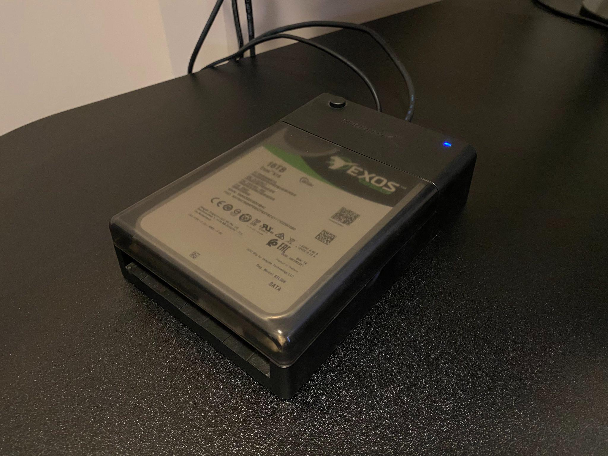
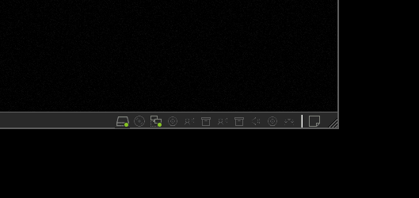
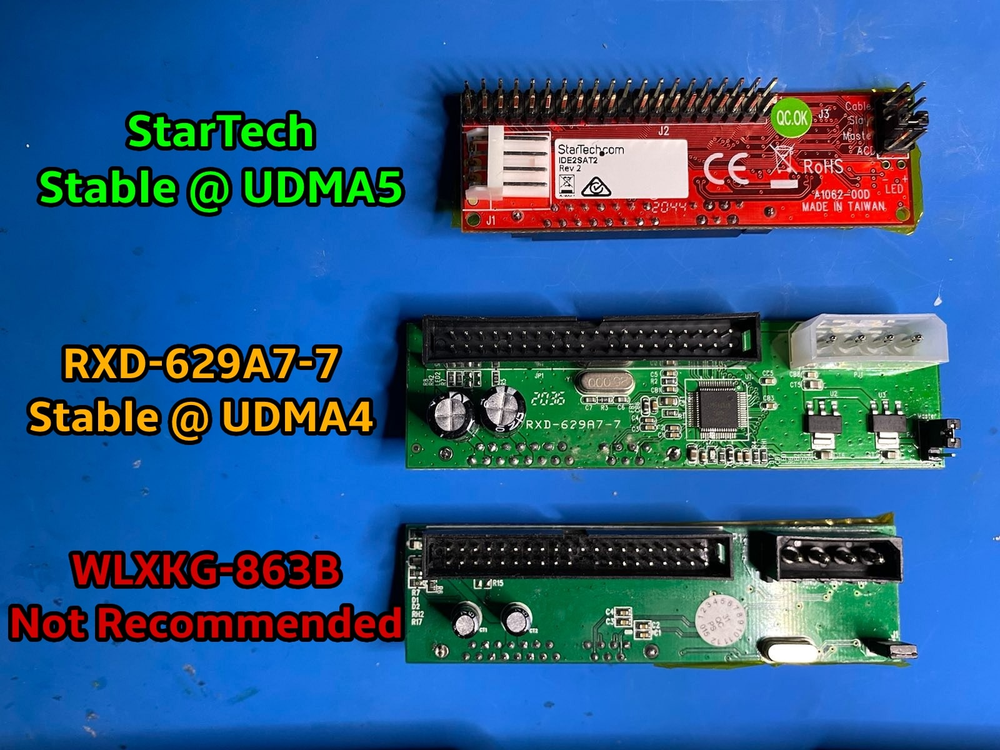
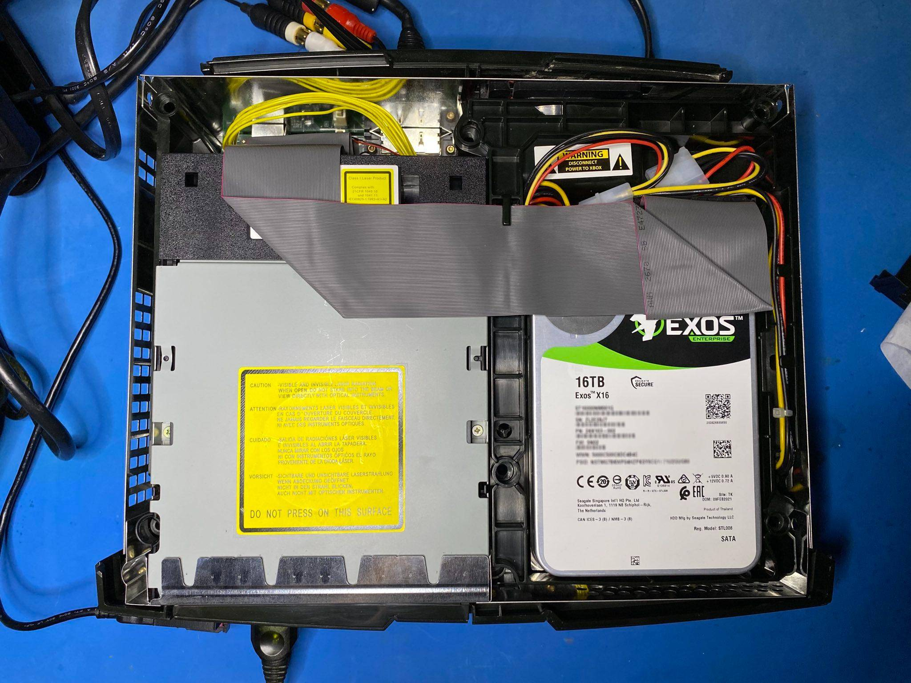
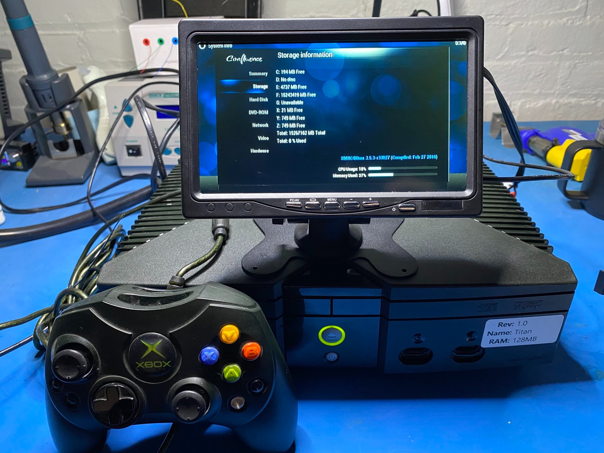

# Titan - Xbox Setup Guide

<p align="center"></p>

## 0. Preface

As an initial release, setting up Titan requires a number of steps that may make the process intimidating to some users. As Xbox homebrew tools and resources are updated, I expect that Titan will become much simpler to setup.

It is **strongly recommended** that you use a modchip for this mod. Softmods could work with Titan (in theory?) but are completely untested and hard to recover a failed install from.

## 1. Apply Kernel Patches

Titan is currently only supported for the popular M8+ BIOS. The checksums for these BIOS images have been provided below. You will have to find these files on your own as they are not included with Titan or as part of this repository.

| BIOS Name                             | MD5 Hash                           |
| ------------------------------------- | ---------------------------------- |
| m8plus                                | `dfc6288f6b67fd021e1970491c64c0a0` |
| m8plus (1.6)                          | `58b8782501983725f984499620ca342b` |

It is recommended that you use [this guide](https://github.com/MakeMHz/xbox-hd-plus/blob/master/manual/Kernel%20Patch%20-%20m8plus.md) for learning how to pack and unpack the `m8plus_kernel.img` from the M8+ BIOS.

Instead of using Lunar IPS to patch the extracted kernel per the guide above, you currently must use the Titan kernel patcher. Titan's PC-based kernel patcher is written in [Python 3](https://www.python.org/). It is *strongly recommended* that you download the [released packages](https://github.com/gaasedelen/titan/releases) which bundle the applicable dependencies for Windows, Linux, and macOS. 

Example usage is provided below:

```
python3 tpatch.py m8plus_kernel.img
```

The `--udma` flag can also be used to patch the kernel to use a higher [UDMA](https://en.wikipedia.org/wiki/UDMA) transfer mode (retail is 2, maximum is 5). Please read the UDMA section of the [additional notes](https://github.com/gaasedelen/titan#additional-notes) provided in the main README for Titan.

```
python3 tpatch.py --udma 5 m8plus_kernel.img
```

Successful output should look something like the following:

```
[*] Patching with Titan v1.0 -- by Markus Gaasedelen
[*] - Hashing kernel 'C:\titan\m8plus_kernel.img' to ensure compatibility
[*] - 0x800243AA: Patching HddStartVerify(...)
[*] - 0x8002443F: Patching HddVerify(...)
[*] - 0x800244E6: Patching HddStartRw_Length(...)
[*] - 0x80024534: Patching HddStartRw_Transfer(...)
[*] - 0x80024632: Patching HddRw_Save(...)
[*] - 0x8002465B: Patching HddRw_Smuggle(...)
[*] - 0x80024485: Patching HddCompleteRw(...)
[*] - 0x800246F3: Patching HddGetDriveGeometry(...)
[*] - 0x8002F066: Patching HddPartitionCreate(...)
[*] - 0x80024B5A: Patching HddCreateQuick(...)
[*] - 0x8005546D: Patching HddCreate(...)
[*] - 0x80027143: Patching FatxParseSupeblock(...)
[*] - 0x80029CE5: Patching FatxStartAsyncIo(...)
[*] - 0x80029E5B: Patching FatxAsyncIo(...)
[+] Patching successful!
```

The resulting `m8plus_kernel.img` can now be re-packed using EVTool, as described in the previously linked [guide](https://github.com/MakeMHz/xbox-hd-plus/blob/master/manual/Kernel%20Patch%20-%20m8plus.md).

The final, re-packed, M8+Titan BIOS should be 256kb and can be flashed to your modchip using any preferred method. An Xbox running the Titan-based kernel is expected to boot and operate (at minimum) identical to a system running vanilla M8+.

## 2. Initializing a HDD for Titan

At the time of writing, it is *strongly recommended* that you format the HDD to be used in the Titan-based Xbox with the open-source [FATX](https://github.com/mborgerson/fatx) tool created by Matt Borgeson. This is PC-based FATX tool that can be used to mount/read/write physical and virtual FATX drives. **It is also the only tool that currently supports increased cluster sizes of 128kb, 256kb, and 512kb.**

If you are a Windows user, it is recommended you setup an Ubuntu Linux 20.x or 21.x virtual machine with [VMware Workstation](https://www.vmware.com/products/workstation-player/workstation-player-evaluation.html) so that you can clone, [build](https://github.com/mborgerson/fatx#how-to-build-natively), and run the FATX project.

Once a virtual machine is set up, the target HDD should be connected to your PC using any [SATA-to-USB](https://www.amazon.com/Sabrent-External-Lay-Flat-Docking-Extension/dp/B08P5Z51MT) adapter:

<p align="center"></p>

Most virtualization solutions will provide a way to pass physical devices attached to the Host PC through to the virtual machine. 

In the GIF below, it shows how the SATA-to-USB drive can be connected to an Ubuntu virtual machine running in VMWare Workstation instead of the Host PC:

<p align="center"></p>

Once the HDD is connected to virtual machine, it can be formatted with the the following command:

```
sudo fatxfs XXX --format=f-takes-all --sectors-per-cluster=1024 --destroy-all-existing-data
```

Please note that`XXX` in the command above should be the path to your attached SATA-to-USB device / HDD. It will most likely be something like `/dev/sdb`, but you can use the command `lsblk -d | grep disk` to list possible devices from within the virtual machine. 

```diff
- PLEASE TRIPLE CHECK THAT YOU ARE FORMATTING THE CORRECT DRIVE ATTACHED TO YOUR VM OR HOST PC -
- PLEASE TRIPLE CHECK THAT YOU ARE FORMATTING THE CORRECT DRIVE ATTACHED TO YOUR VM OR HOST PC -
- PLEASE TRIPLE CHECK THAT YOU ARE FORMATTING THE CORRECT DRIVE ATTACHED TO YOUR VM OR HOST PC -
```

You can then mount the drive and copy a dashboard such as XBMC or EvoX into the C partition:

```
mkdir mountpoint
sudo fatxfs /dev/sdb --drive=c mountpoint
sudo cp ~/evox.xbe mountpoint/xboxdash.xbe
sudo fusermount -u mountpoint
```

Once you have the HDD fully formatted and an `xboxdash.xbe` placed in the C partition, the drive can be disconnected from the PC and installed into the Xbox.

_**NOTE: It may be possible for existing tools to format a HDD for Titan from the Xbox itself, but there are several ways I imagine they can or will fail until they are properly updated and tested. Additionally, all existing tools will max out at 64kb cluster sizes, meaning it may take several minutes for a large Titan FATX volume to be mounted on bootup/access. Attempt alternative methods at your own discretion.**_

## 4. Installing the HDD

Your choice of IDE-to-SATA adapter and configured UDMA speed (see comments about `--udma`) may affect the speed, performance, and stability of your drive once installed into the Xbox. 

At the time of writing, only the following adapters paired with an 80 wire IDE cable have been tested with Titan:

<p align="center"></p>

Other adapters may work, but have not been tested. Please feel free to report any successes or failures with other types of adapters/chipsets that facilitate IDE-to-SATA communications.

In the context of UDMA modes, 'unstable' means that system may not boot, or if it does, there may be transfer errors occurring while trying to use the system. This will manifest as 'long load times' (read/writes failing and having to be re-tried), erratic copy rates in DVD2Xbox, stuttering media playback, etc.

<p align="center"></p>

Please take extreme caution when installing the SATA adapter into your Xbox. Almost universally, IDE-to-SATA adapters lack any sort of backing to go between the HDD housing and exposed leads on the back of the adapter. This is extremely unsettling to install without some form of insulation between the board and the drive housing (Kapton Tape, 3D printed shroud, etc.).

Assuming all of the steps were followed correctly, the Titan partition (F) should be visible and available for use.

<p align="center"></p>
