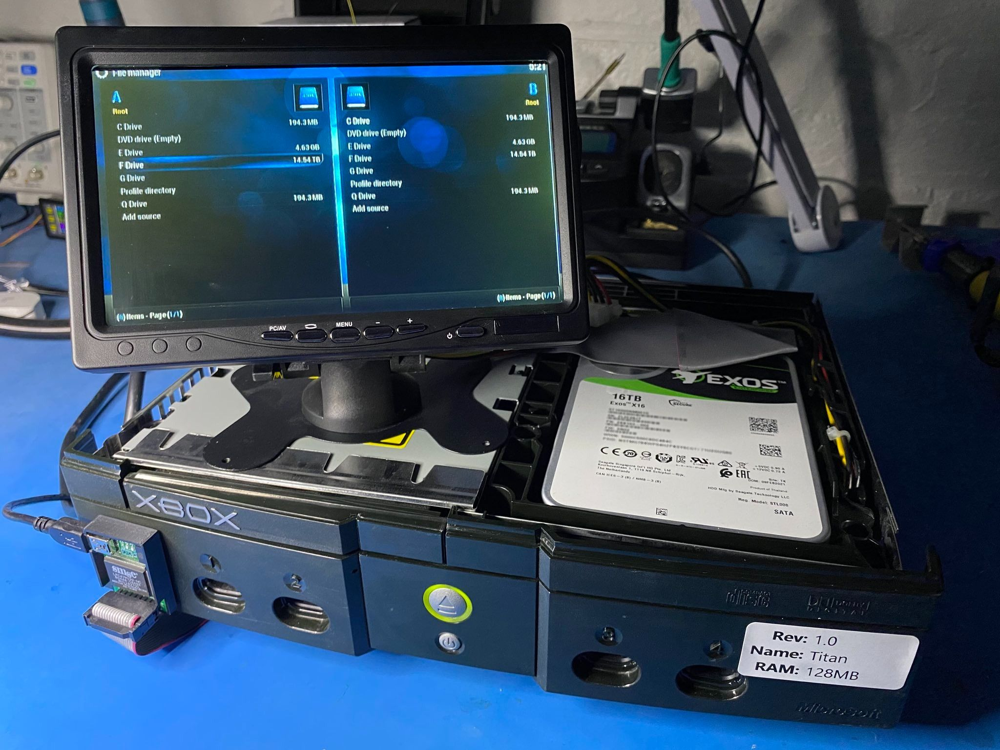

# Titan - Xbox Kernel Patches for Extended Storage

<p align="center"></p>

## Overview

Titan is a series of hand-written binary patches for the original [Microsoft Xbox](https://en.wikipedia.org/wiki/Xbox_(console)) kernel. These patches are designed to expand the  storage capabilities of the popular 2001 game console in excess of 16TB. This is achieved by modifying the kernel to support [LBA48](https://en.wikipedia.org/wiki/Logical_block_addressing#LBA48) and extending the number of addressable 512-byte disk sectors in the IO stack.

Special thanks to Mike Davis for his [serial debugging](https://github.com/XboxDev/serial-usb-adapter) boards, Matt Borgerson for his tireless efforts on [XEMU](https://github.com/mborgerson/xemu) & [FATX](https://github.com/mborgerson/fatx), and finally Paul Bartholomew (oz_paulb) for his original LBA48 research from [2003](http://hackspot.net/XboxBlog/?page_id=2) which facilitated up to 2TB for the past 15+ years. All of these people and their open-source works played an important role in the creation of Titan.

## Disclaimer

**This project does NOT use any copyrighted code, or help circumvent security mechanisms of an Xbox console.**

These patches should be considered highly experimental pending further attestation. By using this software, you accept the risk of experiencing total loss or destruction of data on the console in question.

Titan may break existing Xbox homebrew, and existing homebrew may break Titan-based systems.

## Usage

Titan's PC-based kernel patcher is written in [Python 3](https://www.python.org/). It is *strongly recommended* that you download the [released packages](https://github.com/gaasedelen/titan/releases) which bundle the applicable dependencies for Windows, Linux, and macOS. 

Example usage is provided below:

```
python3 tpatch.py m8plus_kernel.img
```

Successful output should look something like the following:

```
[*] Patching with Titan v1.0 -- by Markus Gaasedelen
[*] - Hashing kernel 'C:\titan\m8plus_kernel.img' to ensure compatibility
[*] - 0x800243AA: Patching HddStartVerify(...)
[*] - 0x8002443F: Patching HddVerify(...)
[*] - 0x800244E6: Patching HddStartRw_Length(...)
[*] - 0x80024534: Patching HddStartRw_Transfer(...)
[*] - 0x80024632: Patching HddRw_Save(...)
[*] - 0x8002465B: Patching HddRw_Smuggle(...)
[*] - 0x80024485: Patching HddCompleteRw(...)
[*] - 0x800246F3: Patching HddGetDriveGeometry(...)
[*] - 0x8002F066: Patching HddPartitionCreate(...)
[*] - 0x80024B5A: Patching HddCreateQuick(...)
[*] - 0x8005546D: Patching HddCreate(...)
[*] - 0x80027143: Patching FatxParseSupeblock(...)
[*] - 0x80029CE5: Patching FatxStartAsyncIo(...)
[*] - 0x80029E5B: Patching FatxAsyncIo(...)
[+] Patching successful!
```

For a full walkthrough of setting up an Xbox with Titan, please refer to the [GUIDE.md](GUIDE.md) provided in this repo.

## Additional Notes

Some additional notes about Titan are as follows:

 * **Formatting**
    * The [FATX](https://github.com/mborgerson/fatx) project and [FATXplorer](https://fatxplorer.eaton-works.com/) are currently the only tested/supported methods to format a disk for a Titan-based system
    * XBPartitioner/XBlast/XeniumOS are all considered unsupported and probably require updates
      * I fully expect these tools to get updated releases in the near-future
 * **Partitions**
    * Titan is essentially hardcoded to use a 'F (Partition 6) Takes All'-esque partitioning scheme
    * Titan could be extended to support additional partitions, but it seems unnecessary
 * **Clusters**
    * Titan allows increased cluster sizes of 128kb, 256kb, 512kb, 1mb
      * **It is strongly recommended to format large disks (2TB+) with 1024 sectors per cluster (512kb)**
      * Matt's [FATX](https://github.com/mborgerson/fatx) project and [FATXplorer](https://fatxplorer.eaton-works.com/) are currently the only tools that can format disks with larger clusters
    * Due to how the kernel caches file information in-memory, partitions are limited to 2^24 clusters
      * 128kb clusters - up to 2TB partition size
      * 256kb clusters - up to 4TB partition size
      * 512kb clusters - up to 8TB partition size
      * 1mb clusters - up to 16TB partition size
    * Increased cluster sizes dramatically increases the speed of mounting FATX volumes (faster bootup)
    * Increased cluster sizes will ensure more linear reads on the disk (faster file reads, game loading, etc.)
    * Increased cluster sizes allows for more items in the root disk directory (8192 items at 512kb clusters)
    * If you're using Titan, you can afford the luxury of bigger clusters so stop complaining about wasted space
 * **UDMA**
    * Titan can change the [UDMA](https://en.wikipedia.org/wiki/UDMA) transfer mode used by the kernel with `--udma N`
       * Increasing the UDMA mode has been profiled to improve some game load times in excess of 20%
         * A full benchmark with SSD + StarTech shows disk IO is 70-100% faster across the board
       * Increasing the UDMA mode will require an 80 wire IDE cable
    * The retail Xbox uses UDMA 2 (33mb/s) by default (as do many/all (?) modified BIOS')
    * The maximum supported UDMA mode by the Xbox southbridge is UDMA 5 (100mb/s HDD <--> CPU)
      * **UDMA 5 DOES NOT WORK WITH ALL IDE TO SATA ADAPTERS**
      * UDMA 5 is confirmed to be working and stable with StarTech adapters
      * UDMA 5 is unstable on RXD-629A7-7 based adapters, but UDMA 4 seems okay
      * WLXKG-863B are the 'worst' adapters I have experienced working on Titan and are largely untested
 * **Games**
    * A random assortment of games have been tested to ensure some baseline on system stability
      * I don't expect major issues here, but more testing should be obviously be done 
 * **Dashboards**
    * XBMC seems to work fine
      * DVD drive status can be flakey in XBMC under higher UDMA modes (SMBus issues? most likely)
    * EvoX seems to work fine
      * EvoX displays the incorrect disk size because it [performs](https://github.com/gaasedelen/titan/blob/main/screenshots/evox_bug.png) a modulus of 'available gigabytes' by 1000
        * This does not mean that you formatted incorrectly, or that the HDD is corrupt
      * FTP seems okay?
    * Dashboard-based FTPs are probably much safer than BIOS-based FTP (eg. XeniumOS)
    * Consider all other dashboards as untested
  * **Other Homebrew Notes**
    * DVD2Xbox works fine
    * FTP via XeniumOS is probably risky. I would only use it to transfer files onto RETAIL partitions (C or E)
    * Anything booting into a BFM BIOS (PBL, Hexen?) is totally unsupported for accessing the Titan partition (F)
    * It should be possible to tweak M8+Titan with a modified version of EVTool (will release more info soon)
    * Consider all other homebrew as untested
  * **Patches** 
    * Titan is only supported on the M8+ kernel. M8+ is a modified version of the final retail kernel (5838)
      * Titan/M8+ can be used on ALL retail hardware revisions (1.0 -> 1.6b)
      * These patches can almost certainly be ported to other Xbox kernels, but not something I plan on doing
    * Previous iterations of these patches modified the kernel to use 4K sectors but was deemed unnecessary
      * The released patches can be further simplified, moving away from the original 4K implementation
    * More experimental patches that further accelerate mounting large FATX volumes may be added later

## Contributing

The best thing you can do to contribute would be to test games or homebrew and report breakages. Please only file an issue if something does not behave the same on a Titan-based system versus a stock M8plus-based system.

This project is permissively licensed, and the included patches are easy to read and modify. If you're feeling truly adventurous, you can try porting the patches to another popular version of the original Xbox kernel.

## Authors

* Markus Gaasedelen ([@gaasedelen](https://twitter.com/gaasedelen))
